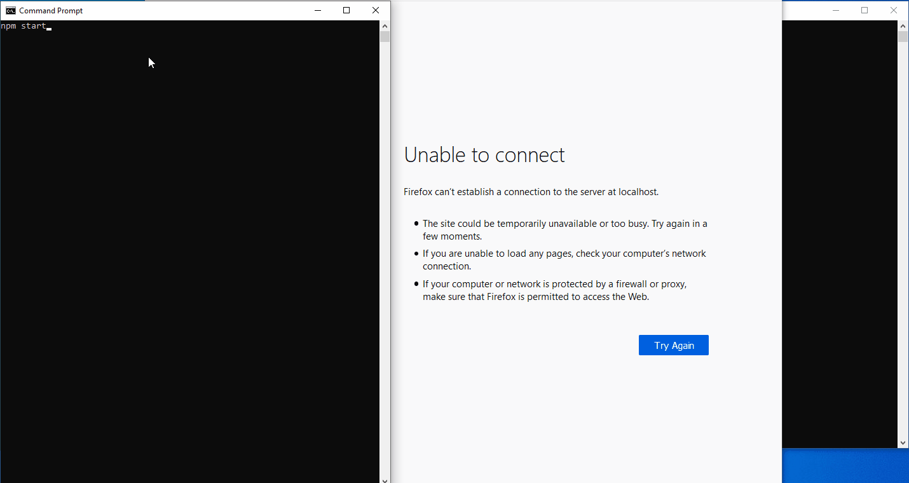

# is-up
A web-status monitoring sites that checks whether they are down or not; A NodeJS site that can run without external dependencies.

# Product

# Getting Started
1. Install using the `npm install` command.
2. Create the database schema:
    - for pSQL database use [`schema.sql`](migration/schema.sql) file 
      - configure pSQL *host, port, username, password* in the [`config.js`](config.js)
      - Set *database.database* to `'db'` in the [`config.js`](config.js)
    - for file-system based database [`npm run fs_schema`](migration/fs_schema.js) )
      - Set *database.database* to `'fs'` in the [`config.js`](config.js)
3. Start the web server `npm run start`
4. Go to [http://localhost/](http://localhost/) in your browser.

# Dependencies
See [package.json](package.json)
 - Node JS 12
 - optionally pg & pSQL

 # Configurations
 Some configuration options, such as ports, hashing secret, applicaton name, ... are provided in the [`config.js`](config.js).

Static files in the public folder are accessessable via http://localhost/public/*FILENAME* route.

Additional routes can be configured via the [`router.js`](server/router.js) and [`handlers.js`](server/handlers.js).

Templates are served via the [getTemplate(*TEMPLATENAME*)](lib/serve_contents.js) function, and are located in the [templates](templates) folder.